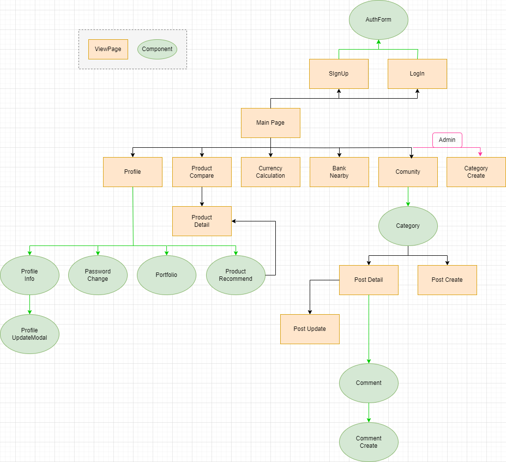
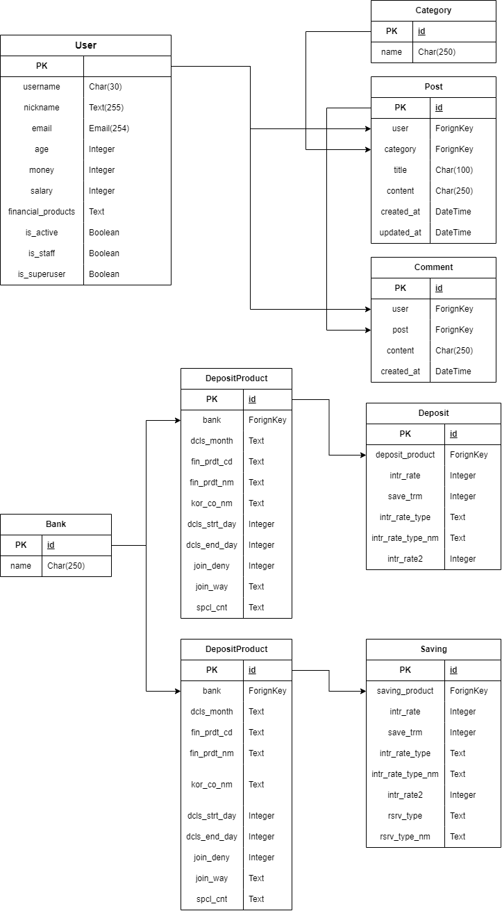

<h1 align="center">💰 금융 상품 추천 사이트</h1>

[🔍 설계 구조](#🍀-설계-내용) [✏️ 상품추천 알고리즘](#🐰-금융상품-추천-알고리즘-설명) [🔧 기능 및 에러사항](#🐳-서비스-기능)

## :heart: 사이트 소개
```py
def 집 한채 장만하고자 하는 큰 포부를 가지고
input 열심히 일하며 알뜰히 저축하고자 하는
return 여러분들에게 필요한 금융상품을 추천하는 사이트입니다.
```


## :clap: 팀원 소개
```md
> 전규훈
- 금융 추천 알고리즘
- 지도 검색 페이지
- 환율 검색 페이지
- 상품 이윤 계산기

> 이승호
- 금융상품 비교
- 게시판 페이지
- 프로필 페이지
```


## :four_leaf_clover: 설계 내용


## :maple_leaf: ERD



## :rabbit: 금융상품 추천 알고리즘 설명
```md
"사용자(User)의 나이, 연봉, 현재 소지 금액 정보를 통해 세가지 정보를 합친 뒤 상황이 비슷한 다른 사용자들이 가입한 상품들을 추천"


1. admin 제외 전체 user 목록 불러오기
2. 현재 user의 나이, 현재 가진 금액, 연봉 각각에 대한 인접한 상품 sort
3. 세 정보를 모두 합친 최종 상품 추천


불러와야 할 정보

1. user 전체 리스트
2. 금융 상품 목록
3. 현재 유저 정보


- 컴포넌트가 있을 경우만 동작하도록 함

1. 전체 상품 리스트 들고오기
2. 전체 user의 나이, 재산, 현재 가진 돈 순으로 정렬된 각각의 리스트 생성
3. 각각의 리스트를 순회하면서 상품정보와 인덱스 정보를 객체로 저장. 저장된 
    3-1. 각 리스트에서 본 상품을 돌았는지 체크. 만약 돌았다면 continue. 
	3-2. 만약 돌지 않았다면 현재 리스트의 인덱스 넘버를 객체의 인덱스 정보에 더해준다.
4.  저장된 리스트의 인덱스 넘버를 오름차순으로 정렬하여 사용자에게 추천.
```


## :whale: 서비스 기능
|      | 기능                                     | 기능설명                                                     |
| ---- | ---------------------------------------- | ------------------------------------------------------------ |
| 1    | 반응형 로그인 /회원가입                  | JWT 토큰을 통한 유저 회원가입 및 인증 기능 구현                |
| 2    | 로그아웃                                 | localstorge에 저장한 JWT 토큰 삭제 기능 구현                  |
| 3    | 로그인 인증                               | 로그인 인증 유무에 따른 출력 페이지 및 접속 가능 여부 구현      |
| 4    | 프로필 조회                          | 유저 정보, 정보 수정, 가입 상품 정보, 상품 추천 받기 구현           |
| 5    | 로그아웃, 회원탈퇴, 회원정보 수정          | 로그아웃, 회원탈퇴, 및 회원정보 개별 수정 기능 모달창 구현          |
| 6    | 가입한 상품 리스트 조회 및 차트 생성        | 가입한 상품 목록과 상품별 금리 비교 차트 표시              |
| 7    | 상품 추천 받기 알고리즘                 | 나이, 자산, 연봉 정보 활용 타 유저들 가입정보로 상품 추천 기능 구현 |
| 8    | 금융상품 데이터 요청 및 저장                | 금융감독원API 요청을 통해 정기예금, 정기적금 데이터 저장    |
| 9    | 금융상품 검색 기능                      | 은행명, 예치기간 별 상품 데이터 조회 기능 구현              |
| 10   | 금융상품 조회                        | 금융상품 정보 조회, 유저별 금융상품 저장 및 삭제 기능 구현           |
| 11   | 기간별 투자 수익 계산 기능              | 6, 12, 24, 36개월 각 개월 별 예상 수익금 계산 기능 구현             |
| 12   | 환율 데이터 요청 및 저장              | API 요청을 통해 국가별 환율 정보 데이터 저장          |
| 13   | 환율 계산 기능                          | 외화 -> 원화, 원화 -> 외화 환율 계산 기능 구현        |
|14|근처 은행 위치 검색| 카카오맵 API를 활용하여 10km 이내 가까운 은행 위치 검색|
| 15   | 카테고리 생성/ 삭제                      | 관리자 한정 카테고리 생성 기능 및 삭제 구현               |
| 16   | 게시글 생성/ 삭제                          | 특정 카테고리의 게시글 생성 기능 및 삭제 구현                 |
| 17   | 공지사항, 전체게시판                         | 모든 카테고리에 노출되는 공지사항 및 전체 게시글 조회 기능 구현  |
| 18   | 댓글 생성/ 삭제                          | 특정 게시글의 댓글 생성 기능 및 삭제 구현                      |
| 19   | 게시글 좋아요 기능                       | 특정 게시물 좋아요 추가 및 삭제 기능 구현                      |
| 20   | 캐러셀 기능                       | 메인 화면 소개 글 및 로그인, 금융상품 정보 페이지 라우터 기능 캐러셀로 표시   |
|21|상품 금리에 따른 이윤 계산기|상품에 가입했을 경우 가입 금액에 따른 추정 이익 계산|


## :dizzy: 에러 사항
|      | 에러사항                                     | 해결방법                                                    |
| ---- | ---------------------------------------- | ------------------------------------------------------------ |
| 1    | 좋아요 클릭시 좋아요 수 실시간 미반영               | 프론트에서 출력함수 computed를 통해 실시간 데이터 업데이트        |
| 2    | db 초기화 후 프론트 접속 시 로그인 정보 남아있음         |  새로고침으로 유저정보 조회 후 토큰인증 실패 하면 인증정보 초기화 -> 로그인 페이지 이동 |
| 3    | 스크롤창이 페이지 크기를 넘어섬  | 부모노드의 페이지 크기를 동적으로 전달하여 해당 크기를 스크롤 크기에 활용    |
| 4    |환율 API Load 시 정보가 불러와지지 않고 null 값이 불러와져 오류가 생기는 현상|렌더링 시 v-if를 사용하여 환율 정보가 null 이 아닐 경우에만 렌더링 되도록 설정|
| 5    |카카오맵 API 사용 시 이유를 모르는 오류가 생기는 현상|카카오 develop 사이트에서 카카오 맵 관련 내장함수를 찾아보며 내장함수의 포함 인자 등을 검색하여 해결|


## :smirk: 느낀점
>## ✔ 전규훈
>
> 무에서 유를 창조해야 하는 프로젝트 답게 초반에 스켈레톤 코드 조차 없어 막막함을 안고 프로젝트를 시작했다. 어떤 것부터 시작해야 할 지 몰라 우선 명세서를 보고 해결해야 할 우선순위를 정하였고, 하루에 적어도 하나 이상의 명세를 끝낼 수 있도록 하였다.
>
> 결과적으로 모든 명세에 나와있는 기능을 구현하였고, 추가적인 기능 역시 구현할 수 있었다. 이번 프로젝트에서 3개의 API를 다뤘는데 이를 통해 json 파일을 다루는 법과 객체를 다루는 법에 매우 익숙해진 것 같다. 또한 실습과는 다르게 서버를 관리하는 법에 대해서 더욱 익숙해졌고, 부족했던 css에 대해 bootstrap을 사용하며 html 구조 및 어떤 태그에 어떤 스타일을 입혀야 할 지에 대해서도 이해할 수 있었다.
>
> 초반에는 Front와 Back을 나누어 진행하였지만 시간이 지날 수록 나와 팀원 둘 다 풀스택을 다룬 것 같다. 힘들었지만 오히려 두 분야 모든 곳에 대한 얕았던 지식을 단단히 할 수 있었던 것 같다. 

> ## ✔ 이승호
> 
> 프로젝트를 시작하기 앞서 배웠던 뷰와 장고 프레임워크는 데이터를 서로 주고받는 구조가 복잡해 보여 이해하기 힘들었다. 처음 설계 구조를 계획하며 구조와 방향성을 잡아가게 되었고 그 과정에서 확실히 데이터 및 시스템이 실행되는 구조를 확실히 이해하게 되었다. 기능 하나를 만들때마다 10개의 에러를 만나며 찾기 힘들었더 웹에서의 에러도 점점 익숙해졌고 빨리 해결할 수 있었다. 가장 중요한 것은 데이터가 쌓여갈 때마다 그 구조를 확실히 이해하고 서로 충돌이 일어나지 않도록 각 데이터를 잘 보관하고 관리하는 작업이었다.
> 
> 첫 프로젝트라서 하나부터 열까지 찾아가며 하다보니 어떻게 작업해야 할지 막막했는데 프로젝트가 진행될수록 각 기능을 위한 코드를 작성하는 원리가 쉽게 떠올랐고, 무엇보다 다양한 라이브러리를 스스로 찾아가며 새롭게 적용하는 방식을 익혀 많은 도움이 되었다.
> 
> 결과물의 완성도가 부족해보이지만 과정에서 얻은 학습내용과 실제 프로젝트 진행 사항을 이해할 수 있어 개발자로서 초기 역량을 키울 수 있었고, 다양한 프로젝트를 만날때 마다 도전하고 노력할 수 있는 마음가짐을 갖게 되었다.
